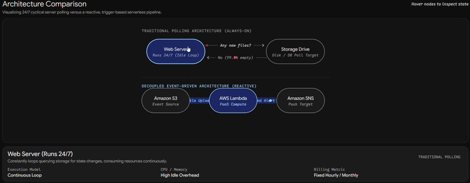

# Serverless Event-Driven File Notifier ☁️

An automated cloud architecture built on AWS that triggers real-time notifications upon file uploads. This project demonstrates decoupling, serverless compute, and event-driven design—foundational concepts for modern data engineering and scalable AI pipelines.

## 🏗 Architecture
- **Amazon S3:** Acts as the event source. Triggers a payload upon object creation.
- **AWS Lambda (Python):** The serverless compute layer. Parses the S3 event metadata and formats the alert.
- **Amazon SNS:** Handles the Pub/Sub fan-out to securely deliver the message to subscribed endpoints.

## 🚀 How it Works
1. A user or application uploads a file to the configured S3 bucket.
2. S3 automatically invokes the Lambda function, passing the object details in a JSON event.
3. Lambda extracts the `bucket_name` and `object_key`.
4. Lambda publishes a formatted message to an SNS topic.
5. SNS distributes the notification to all confirmed subscribers.

## 🛠 Skills & Technologies Demonstrated
- Cloud Infrastructure Management (AWS)
- Identity and Access Management (IAM) Roles & Policies
- Serverless Event Routing
- Python (Boto3 SDK)